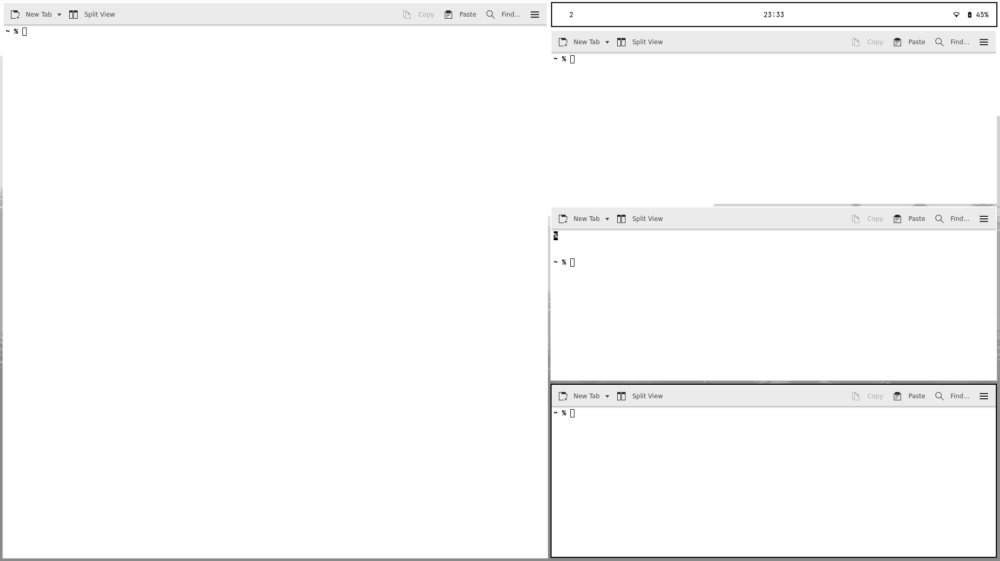
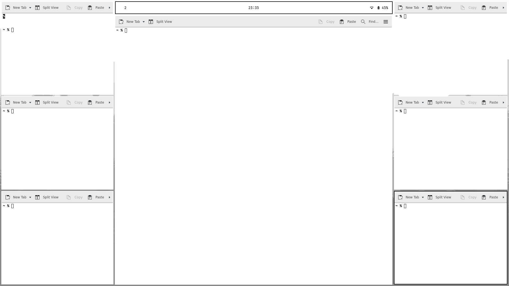
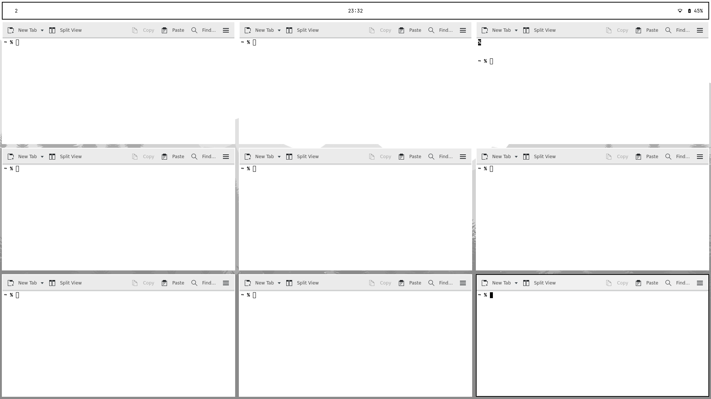

# Riverbed

Riverbed is a set of configuration files and programs to turn the [river
wayland compositor](https://codeberg.org/river/) into a bare-bones desktop
environment.

## Installation

This repository is designed for installation on top of an existing alpine edge
console installation. Make sure the [testing repository is enabled on your system](https://wiki.alpinelinux.org/wiki/Repositories#Using_testing_repository).

All files in the `home` folder should be placed in your `$HOME`, though they
each need to be prepended with a dot. So `config` goes to `.config`, `profile`
goes to `.profile` etcetera.

Files in the etc folder must be moved by a privileged user into `/etc/`. Though
they are optional.

The files in `local/bin/` need to be given permission to be executed `chmod +x
local/bin/*`. The folder so-far contains the following scripts.

- `tofi-polkit-agent` must be installed if you want gui privilege escalation to
  work, for instance for authenticating keyring and such.
- screenselect A tofi enabled program that allows you to select an output, used
  by xdg-desktop-portal-wlr
-`nmtui` and `alsamixer` are simple wrapper scripts to run the respective
  programs without color
- `latex` is a helper script which I use for compiling latex documents, It
  hides the auxiliary files in a folder called `.build`. Uses lualatex by
  default. 

### !!! WARNING !!!

You Should **ADD** the contents of `etc/apk/world` to your
existing apk world file, **DO NOT REPLACE THE FILE OR YOU MAY BREAK YOUR
INSTALL**.  The file in this repository does not contain a Linux kernel, network
divers, etcetera.

## Usage

Riverbed is configured through the use of a few configuration files as well as
the `riverbedctl` command. The configuration files are located at `config/river`
and are named `variables`, `keybinds`, `autostart` and `custom`. The purpose of
each should be clear by the name. Important to note is that `keybinds` and
`custom` are both scripts allowing for greater flexibility.

`riverbedctl` is the command line utility used for updating aspects of the
desktop such as the current layout, gaps, border-colors, etcetera. Unlike
`riverctl`, riverbedctl will inform the various parts of the desktop
synchronously. Therefore, changing the layout will for instance change the size
and position of the system bar.

These are the various functions of riverbedctl:

- Setting any variable from `config/river/variables` by calling `riverbedctl
  variable=value`. These settings must be saved manually to the configuration
  file and will otherwise me lost upon reset.
- Calling any function from `config/river/init` notably
	+ `customs` will reload the `config/river/customs` file
	+ `reload_keybinds` will reload the `config/river/keybinds` file
- riverbedctl will always re-synchronize the configurations for wob, waybar,
  fnott, tofi, and luatile

### Programs

Riverbed uses the following programs:

| program | Purpose |
|----------------|--------------------------|
| river | Compositor |
| river-luatile | Layout Manager |
| way bar | Status bar |
| tofi | Launcher, Polkit-agent * pinentry |
| fnott | Notifications |

Riverbed does rely on other programs and libraries to be present on your system,
please check `etc/apk/world` for a full list.

I personally use the KDE suite of applications, but this can easily be
substituted by with GNOME or DE agnostic applications.

## Alpine-specific

This setup is intended for use on Alpine Linux and its derivatives, I currently
have no interest in porting it to other distributions. That being said, other
than the files in `etc/apk`, everything should be cross-compatible.

If you are installing on a different distribution, you can look at
`etc/apk/world` for a list of programs that you would need to install. This
section will outline the other alpine-specific bits of this setup so that you
can adjust it for your needs.

### Packages

Most programs used in this setup are available in the main alpine repositories,
though some are currently in testing. Other still are not available at all, this
repository contains custom `APKBUILD` files for these programs.

### Elogind/systemd

This setup does not rely on `systemd` or `elogind`. Therefore, in order to keep
`polkit` and `dbus` working, I launch river with a combination of `consolekit`
and `dbus-launch`. If you use a `systemd` distro or use `elogind`, this may be
different.

For the same reason, I use `seatd` for seat management. For this to work, the
`seatd` system service must be running, and the user must be part of the `seat`
group

## Window layout

Riverbed supports three different window layouts, each with various settings.

`Runoff` is a simple master-stack layout which always reserves space for the
stack, even if there is only one window in screen. It also reserves space for
the bar which only takes up around 40% of the screen width.  The size of the
master and stack can be controlled with the `main_ratio` variable.

`Dual` is a variation on the mater stack layout which will make the main window
take up the center and align one stack on either side.

`Grid` will sort windows into a more-or-less equal grid of windows. This layout
ignores the `main_ratio` window and does is the only one where the bar takes up
the full screen width. The grid is controlled by two variables: `columns` is a
hard-coded limit to the number to horizontal stacks riverbed will sort windows
into. While `dynamic_columns` can be set to dynamically create more columns as
the number of windows increase.

## Screenshots

### Runoff

### Dual

### Grid

### Launcher, OSD and Notification use the same space and styling as the bar

