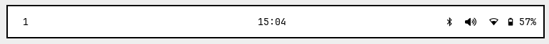

# Riverbed

Riverbed is a set of configuration files and programs to turn the [river
wayland compositor](https://codeberg.org/river/) into a bare-bones desktop
environment.

## Installation

This repository is designed for installation on top of an existing alpine
console installation

The files in the `config` folder go into `$XDG_CONFIG_HOME` except for the
`gnupg` folder which goes to `$HOME/.gnupg`.

Files in the etc folder must be moved by a privileged user into `/etc/`. Though
they are optional.

The files in local must be moved to `$HOME/.local/`. This folder so-far only
contains a few minor scripts and one major one.

- `tofi-polkit-agent` must be installed if you want gui privilege escalation to
  work, for instance for authenticating keyring and such.
-`nmtui` and `alsamixer` are simple wrapper scripts to run the respective
  programs without color
- `latex` is a helper script which I use for compiling latex documents, It
  hides the auxiliary files in a folder called `.build`. Uses lualatex by
  default. 

### !!! WARNING !!!

You Should **ADD** the contents of `etc/apk/world` to your
existing apk world file, **DO NOT REPLACE THE FILE OR YOU MAY BREAK YOUR
INSTALL**.  The file in this repository does not contain a Linux kernel, network
divers, etcetera.

### Programs

Riverbed uses the following programs
| program | Purpose |
|----------------|--------------------------|
| river | Compositor |
| river-luatile | Layout Manager |
| way bar | Status bar |
| tofi | Launcher, Polkit-agent * pinentry |
| fnott | Notifications |
| brightnessctl | Brightness management |
| grimshot | Screenshots |
| doas | CLI privilege escalation |
| pass | Password and OTP manager |

I personally use the KDE suite of applications, but this can easily be
substituted by with GNOME or DE agnostic applications.

## Alpine-specific

This setup is intended for use on Alpine Linux and its derivatives, I currently
have no interest in porting it to other distributions. That being said, other
than the files in `etc/apk`, everything should be cross-compatible.

If you are installing on a different distribution, you can look at
`etc/apk/world` for a list of programs that you would need to install. This
section will outline the other alpine-specific bits of this setup so that you
can adjust it for your needs.

### Packages

Most programs used in this setup are available in the main alpine repositories,
though some are currently in testing. Other still are not available at all, this
repository contains custom `APKBUILD` files for these programs.

### Elogind/systemd

This setup does not rely on `systemd` or `elogind`. Therefore, in order to keep
`polkit` and `dbus` working, I launch river with a combination of `consolekit`
and `dbus-launch`. If you use a `systemd` distro or use `elogind`, this may be
different.

For the same reason, I use `seatd` for seat management. For this to work, the
`seatd` system service must be running, and the user must be part of the `seat`
group

## Window layout

Riverbed uses a custom layout I call runoff. It is a simple master-stack layout
which always reserves space for the stack, even if there is only one window in
screen. It also reserves space for the bar which only takes up around 40% of the
screen width.

Settings regarding the layout can be changed by editing the `river-luatile`
configuration, though one must then also change the configuration files for
`tofi` and `waybar` to match.

## Screenshots

### No windows

### Full screen

### The stack space is always available

### The Bar, taking up 40% of the screen

### Launcher, OSD and Notification use the same space and styling as the bar

## Hacks

The current `waybar` configuration is a bit of a hack, using a transparent bar
with a wide left-side margin to get a partial bar. I am working on a patch for
way bar that allows one to set a smaller bar anchored to a corner to alleviate
this problem.
